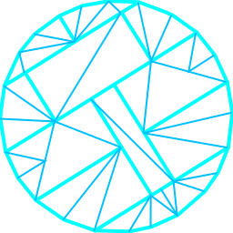

    
	 
	 
	
 <b>Teamspen's Hammer Addons </b>

## Features

* Auto-packing - Automatically packs non-stock game files into the bsp. Filtered based on search paths in the included custom gameinfo and FGD database. Assets can also be packed manually with `comp_pack` entities.
* Static prop combining - merges together adjacent props to allow them to be efficently drawn in batches. To use, decompile props and configure the folder & studioMDL's path then place `comp_propcombine_set` entities.
* A [unified FGD database][unifiedfgd], allowing keyvalues to be shared among games, and accurately defining when features were added and removed.
* Many more entity options, and an improved editor layout.
* New sprites for almost all entities, both custom made and from a number of [other sources](#development).
* Adds lots more AutoVisgroups for easily hiding entities.
* Improvements for games supporting VScript:
	* In any `RunScriptCode` input, backticks can be used for string literals, instead of the disallowed `"` character. 
	* In addition to the normal `Entity Scripts` section, a new `Init Code` field can be used to write code that's packed and added to those scripts. Useful for setting configuration options etc. Backticks can be used here too.
* New `comp_` entities. These are mainly intended for use in instances, allowing modifying entities outside of the instance to conform or doing normally impossible things like positioning things in the void:

| Entity                                             | Description |
|----------------------------------------------------|-------------|
| `comp_choreo_sceneset`                             | Chains a set of choreographed scenes together. |
| `comp_entity_finder`                               | Finds the closest entity of a given type, then applies various transformations. Outputs from this entity will be moved to the found entity. Further keyvalues can be set manually with SmartEdit off. |
| `comp_entity_mover`                                | Shift an entity by a given amount. This is useful to place entities into the void, for example. |
| `comp_kv_setter`                                   | Sets a keyvalue on an entity to a new value. This is useful to compute spawnflags, or to adjust keyvalues when the target entity's options can't be set to a fixup variable. |
| `comp_numeric_transtition`                         | When triggered, animates a keyvalue/input over time with various options. |
| `comp_pack`                                        | Explicitly identify resources to pack into the map. If more are needed, add additional keyvalues with SmartEdit off. |
| `comp_pack_rename`                                 | Pack a file into the BSP, under a different name than it starts with. |
| `comp_pack_replace_soundscript`                    | Replace a soundscript with a different one. |
| `comp_precache_model`                              | Force a specific model to load, for runtime switching. Duplicates will be removed. |
| `comp_precache_sound`                              | Force a specific sound to load, for runtime switching. Duplicates will be removed. More keyvalues can be added. |
| `comp_prop_cable`/`comp_prop_rope`                 | Generates 3D cables using a static prop. |
| `comp_prop_cable_dynamic`/`comp_prop_rope_dynamic` | Modifies the above to generate a dynamic prop, instead. |
| `comp_propcombine_set`/`comp_propcombine_volume`   | Specifies a group of props that will be combined together, so they more efficiently render. |
| `comp_relay`                                       | Simplified version of `logic_relay` which is able to be optimised away by the compiler. The various inputs and outputs are useful for bundling commands together, or using more appopriate verbs. Inputs only work if given directly from entities (or via instance redirection), not in-game or dynamically. All inputs/outputs may pass through any parameter, if no override is specified. |
| `comp_scriptvar_setter`                            | Assigns data or a group of data to a variable in an entity's VScript scope on spawn. To set an array, provide an index in the variable name in the form `varname[4]`.  All the comp_scriptvars pointing to that variable will be collected into a single array literal, with holes filled by *null*.  If the brackets are empty, these values will fill those holes and then append to the end in an arbitrary order. |
| `comp_vactube_end`                                 | Marks the end point of a vactube. Objects reaching here will be cleaned up. |
| `comp_vactube_junction`                            | Marks a junction in a vactube, where they're forced to change direction. Scanner models near straight nodes will be detected automatically. |
| `comp_vactube_spline`                              | Generates a dynamic vactube model following a set of points. |
| `comp_vactube_object`                              | Registers objects that can appear in the tubing. |
| `comp_vactube_start`                               | Marks the start point of a vactube. This is where they spawn. |

## Installation

* Follow [this guide][installationwiki].
* If using BEEMOD2.4, change Hammer -> Options -> Build Programs to use `vrad_original.exe`.

## Development

* Mapbase's FGDs have been imported as a submodule.
* Some entity sprites are taken from: 
  * [The TF2 Ultimate Mapping Resource Pack][tf2]
  * [ZPS: Supplemental Hammer Icons][zps]
  * [ts2do's HL FGDs][ts2do]

[releases]: https://github.com/TeamSpen210/HammerAddons/releases
[installationwiki]: https://github.com/TeamSpen210/HammerAddons/wiki/Installation
[unifiedfgd]: https://github.com/TeamSpen210/HammerAddons/wiki/Unified-FGD
[skotty]: http://forums.thinking.withportals.com/downloads.php?view=detail&df_id=507
[tf2]: http://forums.tf2maps.net/showthread.php?t=4674
[ts2do]: http://halflife2.filefront.com/file/HalfLife_2_Upgraded_Base_FGDs;48139
[zps]: http://www.necrotalesgames.com/tools/index.php
